How**t**o
=========

Version
-------

Version 02.71 of the "HDS_Performance_Analyse_Tool.exe"

Release Notes
-------------

01.14 error converting uc to ms.\
01.14 DF storage shows response time on LU view\
01.15 block size name corrected\
01.18 df - hdd operation rate and hdd tag count added\
01.19 df -- while creating the csv files if you changed focus the
application did not update the files processed and the application
seemed to hang.\
01.20 if a performance file does not exist the graph is skipped and no
error occur.\
01.22 if hsd is spread over two performance blockst he summry was
wrongly calculated (thanks wolfgang)\
01.24 sometimes the lu calculation crashed (thanks Wolfgang)\
01.26 lu server response time summary was wrongly calculated\
01.30 report window introduced\
01.31 the hsd level in the LU section it should show the cumulated
iops(stacked read write), transfers (stacked read write), hit rate
(fastline read write). This is useful if you use the sizing tool
CPK_VSP\
01.31 last chosen path is now saved in the configuration file\
01.32 LU Port view shows all hsd as fastline (iops and transfer)\
01.33 error in change of stacked view to line view solved\
01.34 error in data gathering solved\
01.35 LU hsd view level 2 crash; LU hsd view level 2 negative values
(thanks Wolfgang)\
01.36 MPPK data chart did not work if you used a time range\
01.37 scalability option is switched off for mppk data and treeview
level 2\
01.38 port transfer level 0 und 1 did not work correctly\
01.38 a click on the legend series removes the series\
01.40 port response time level 1 showed wrong values (thanks billy)\
01.42 in the series name the average value is not shown if it is 0\
01.42 checkboxes in section LU at level 2 (hsd) added.\
01.42 31.05.2013 bug 0000, level 3 lu transfer showed wrong values.\
01.45 in the lu section you can now select some luns of a server and
click on the servername to just view these luns. No stacked view
available for this selection.\
01.45 the legend can be hidden if the label checkbox is unchecked\
01.46 hus-vm processor data was not shown after unzipping the data\
01.47 hus-vm backend data can be displayed\
01.48 menu introduced. labels, background color and the max value are
now in the menu.\
01.49 the \"save configuration\" option can be found in the menu under
„settings". This option can be selected if you wish to save your
configuration for the next time.\
01.50 the max value of a chart series is shown in the legend name.\
01.51 adjusted the clipboard frame that it looks nicer (thanks to rdu)\
01.52 checkboxes added for the pg, mp, cache, port sections. Now you can
select only the elements you wish in one graph\
01.54 the "clear all checkboxes" option is added to deselect all
checkboxes\
01.55 the HUR response time was falsely divided by 1000.\
01.58 regional settings problem with other languages solved.\
01.59 \"cache usage\" and \"cache allocate\" added.\
01.60 lu c2d and d2c added.\
01.61 series name changed that lu d2c has a more self-explaining name.\
02.00 most vsp graphs changed to use the new data gathering engine.\
02.02 lu response time on port level (level 1) added.\
02.03 lu bocksize added at hsd level (thanks to Andrej).\
02.09: ldeveachofcu populate treeview did not show the LDEV section\
02.10 "kb" changed to "kB" on the blocksize chart (thanks to Wolfgang)\
02.11 Remote IO changed from IO/min to a more common unit -\>
value\[IO\] / interval\[min\] \* 60\[s\] (thanks to sven).\
02.12 you can modify by chart (right click) the label on/off and the max
value of the y-axis (thanks to Sam).\
02.13 context menu (right click) supports to change (toggle) from fast
line graphs to stacked area graphs (thanks to Sam).\
02.15 hus-vm populate treeview problem fixed(thanks to steve).\
02.16 if there are fixed max y-axis values these will be set
automatically (thanks to wolfgang)\
02.18 mppk data added\
02.19 mppk procedure implemented. top 20 ldevs cpu und cpu by type\
02.20 initiator ports values (iops, transfer, response) added. the
remote transfer view had KB/s units. changed it to MB/s and removed the
KB/s in the series naming\
02.21 mppk type data changed -\> thanks to Wolfgang\
02.24 read/write ratio auf hsd level eingeführt -\> thanks to Haresh\
02.25 LU section \\ read/write ratio added on lun level\
02.26 fix port checkbox problem -\> thanks to wolfgang hahn\
02.28 added checkboxes for the backend data on VSP and HUS-VM-\> thaks
to Joerg Backschues\
02.29 \"Backend\" changed to \"Path\". thanks to Wolfgang\
02.31 started raidcom parse get ldevlist def\
02.32 problem bug 0001 horst stoeckl fixed. Extraction of midrange
performance files failed.\
02.33 midrange performance export \\ works also if only the unzipped
folder is existent.\
02.34 midrange storage \\ top 20 lu \\ iops, transfer and lun tag count\
02.35 DF \\ added the response time files (total, read, write)\
02.36 collect data progress bar improved\
02.37 Top x graphs in section LDEV (level 0). iops, seq read iops, rand
read iops, seq write iops, rand write iops, transfer, read transfer,
write transfer\
02.40 port initiator ports, open ports added for vsp, usp-v\
02.41 bug in calculation the hit ratio and lun response time on hsd
level. thanks to wolfgang.\
02.42 VSP G1000 support\
02.43 bug 0003 mppk data \"-1\" error fixed\
02.44 bug. if the pfm file was skipped then the program crashed. now it
just skips the files.\
02.45 backcolor now really white, clipboard adjustments (dani ruch)\
02.46 bug. raidcom data read buggy. Switched it off.\
02.47 hm800 populate treeview ok, treeview level 0 display data ok\
02.48 hm800 treeview level 1 and 2 ok\
02.49 treeview level 3 ok\
02.50 Gx00 Support ok. MPPK is missing as i have no performance data
with mppk\
02.51 Gx00 and G1000 - treeview level 3 responsetime added (mark
butterworth)\
02.52 ALL - HSD display bug that some hsd\'s were shown in separate
hsd\'s (mark butterworth)\
02.53 G1000, VSP - cache treeview level 1 checkbox subselect bug (mark
butterworth)\
02.54 create missing data elements with value 0\
02.55 performance export format to identify storage system has changed
(VSP G800 -\> VSP G800 and VSP F800) (Richard Thalhammer)\
02.56 change to support old and new style of storage identifier (Joerg
Backschues)\
02.57 bug -- storage identifier falsely set for VSP G1000(Mark
Butterworth)\
02.58 G800 support with more than 4 cores per CPU(Mark Butterworth)\
02.59 Graph enhancement -- Errors in Graph are not shown (Long Nguyen)\
02.60 Gx00 - Cache Allocation, Cache Used Chart wrong (Mark
Butterworth)\
02.62 Fixed New G100 Storage Type Name from \"VSP G100\" to \"VSP
G100/G200\" (NAKADE，KAZUHIRO)\
02.63 General support for F370 and F700 (Likas Belovsky)\
02.64 Support for F370 and F700 -- Support for more Processor Cores
(Likas Belovsky)\
02.65 Support for G/F900 (Mark Butterworth and Erol Fazlaoglu)\
02.66 Bug fixed with MPB naming (Mark Butterworth)\
02.67 Support for G/F350 (Mark Butterworth)\
02.68 Support for G130 (Alan Hopla)\
02.69 Support for VSP 5000\
02.70 Bug fixed LDEV section not show with VSP5x00 (Simon Leibundgut)\
02.71 Support for Backend HIE data on the VSP5x00 (Simon Leibundgut)

Supportmatrix PC
----------------

Any Windows PC that has Dot Net version 4 installed.

Supported Storage systems
-------------------------
### VSP G-1x00 / VSP 5x00

Supported

Data that can be analyzed if data available:

-   Cache

-   CMPK

-   HUR

-   LDEV

-   LU

-   Parity Group

-   Port

-   Processor

-   True Copy

A best practice command.txt to use could look like

svpip 10.00.00.00

login export \"password\"

show

group PhyPG

group PhyLDEV

group PhyProc

group PhyExG

group PhyExLDEV

group PhyCMPK

group PhyMPPK

group PG

group Port

goup MFPort

group PortWWN

group LU

;group LDEV

group PPCGWWN

group RemoteCopy

group UniversalReplicator

group URJNL

group RCLU

group RCLDEV

group LDEVEachOfCU

shortrange -2400:

outpath \"output\"

option compress

apply

### VSP Gx00 (G/F200, G/F400, G/F600, G/F800)

Supported

Data that can be analyzed if data available:

-   Cache

-   LDEV

-   LU

-   Parity Group

-   Port

-   Processor

-   True Copy

-   HUR

A best practice command.txt to use could look like

ip 10.0.0.0 ; Specifies IP address of SVP \<===== Change to IP Address
of SVP

dkcsn 420101 ; Specifies Serial Number of DKC \<===== Change to Serial
Number of DKC

login maintenance \"raid-maintenance\" ; Logs user into DKC \<=====
Change to predefined Userid/password for exclusive use by export tool

show ; Outputs storing period & gethering interval to standard output

;
+\-\-\-\-\-\-\-\-\-\-\-\-\-\-\-\-\-\-\-\-\-\-\-\-\-\-\-\-\-\-\-\-\-\-\-\-\-\-\-\-\-\-\-\-\-\-\-\-\-\-\-\-\-\-\-\-\-\-\-\-\-\-\-\-\-\-\-\-\-\-\-\-\-\-\-\-\-\-\-\-\-\-\-\-\-\-\-\-\-\-\-\-\-\-\-\-\-\--+

; \| Group commands define the data to be exported.

;
+\-\-\-\-\-\-\-\-\-\-\-\-\-\-\-\-\-\-\-\-\-\-\-\-\-\-\-\-\-\-\-\-\-\-\-\-\-\-\-\-\-\-\-\-\-\-\-\-\-\-\-\-\-\-\-\-\-\-\-\-\-\-\-\-\-\-\-\-\-\-\-\-\-\-\-\-\-\-\-\-\-\-\-\-\-\-\-\-\-\-\-\-\-\-\-\-\-\--+

group PhyPG ; Parity Groups

group PhyLDEV ; Logical Volumes

group PhyProc ; Micro-Processor usage

group PhyExG ; External Volume Group usage

group PhyExLDEV ; External Volume usage

group PhyMPU ; Access Paths and Write Pending

;
+\-\-\-\-\-\-\-\-\-\-\-\-\-\-\-\-\-\-\-\-\-\-\-\-\-\-\-\-\-\-\-\-\-\-\-\-\-\-\-\-\-\-\-\-\-\-\-\-\-\-\-\-\-\-\-\-\-\-\-\-\-\-\-\-\-\-\-\-\-\-\-\-\-\-\-\-\-\-\-\-\-\-\-\-\-\-\-\-\-\-\-\-\-\-\-\-\-\--+

group PG ; Parity Group Statistics

;group LDEV ; LDEV usage in PGs, External Volume Groups or V-VOL Groups

; ; Not required when using LDEVEachOfCU

group Port ; Port usage

group PortWWN ; Stats for HBAs connected to ports.

group LU ; LDEV usage Summarised by LU Path

group PPCGWWN ; Stats about HBAs

group RemoteCopy ; Remote Copy Usage Summarized by Subsystem

group RCLU ; Remote Copy Usage Summarized by LU path

group RCLDEV ; Remote Copy Usage Summarized by LDEV

group UniversalReplicator ; Remote Copy Usage by UR Summarized by
Subsystem

group URJNL ; Remote Copy Usage by UR Summarized by Journal Group

group URLU ; Remote Copy Usage by UR Summarized by LU Path

group URLDEV ; Remote Copy Usage by UR Summarized by LDEV

group LDEVEachOfCU ; LDEV usage in CUs - Recommended

;
+\-\-\-\-\-\-\-\-\-\-\-\-\-\-\-\-\-\-\-\-\-\-\-\-\-\-\-\-\-\-\-\-\-\-\-\-\-\-\-\-\-\-\-\-\-\-\-\-\-\-\-\-\-\-\-\-\-\-\-\-\-\-\-\-\-\-\-\-\-\-\-\-\-\-\-\-\-\-\-\-\-\-\-\-\-\-\-\-\-\-\-\-\-\-\-\-\-\--+

; \| end of group statements

;
+\-\-\-\-\-\-\-\-\-\-\-\-\-\-\-\-\-\-\-\-\-\-\-\-\-\-\-\-\-\-\-\-\-\-\-\-\-\-\-\-\-\-\-\-\-\-\-\-\-\-\-\-\-\-\-\-\-\-\-\-\-\-\-\-\-\-\-\-\-\-\-\-\-\-\-\-\-\-\-\-\-\-\-\-\-\-\-\-\-\-\-\-\-\-\-\-\-\--+

;
+\-\-\-\-\-\-\-\-\-\-\-\-\-\-\-\-\-\-\-\-\-\-\-\-\-\-\-\-\-\-\-\-\-\-\-\-\-\-\-\-\-\-\-\-\-\-\-\-\-\-\-\-\-\-\-\-\-\-\-\-\-\-\-\-\-\-\-\-\-\-\-\-\-\-\-\-\-\-\-\-\-\-\-\-\-\-\-\-\-\-\-\-\-\-\-\-\-\--+

; \| To limit the data collection within a date/time range, use the
following sub-commands:-

; \| range start_timestamp:end_timestamp

; \| Where start_timestamp and end_timestamp are in the format:-
yyyyMMddHHmm

; \| For example:-

; \| yyyyMMddHHmm:yyyyMMddHHmm

; \| range 200607101200:200607111159

; \| The above example will collect range data between 12:00 on 10th
July 2006

; \| and 11:59 on 11th July 2006

; \| NB - this is the time on the SVP - not on your server.

; \| Example below says get the latest 24 hours

; \| (hhmm format)

; \| range -2400:

;
+\-\-\-\-\-\-\-\-\-\-\-\-\-\-\-\-\-\-\-\-\-\-\-\-\-\-\-\-\-\-\-\-\-\-\-\-\-\-\-\-\-\-\-\-\-\-\-\-\-\-\-\-\-\-\-\-\-\-\-\-\-\-\-\-\-\-\-\-\-\-\-\-\-\-\-\-\-\-\-\-\-\-\-\-\-\-\-\-\-\-\-\-\-\-\-\-\-\--+

range -2400:

;
+\-\-\-\-\-\-\-\-\-\-\-\-\-\-\-\-\-\-\-\-\-\-\-\-\-\-\-\-\-\-\-\-\-\-\-\-\-\-\-\-\-\-\-\-\-\-\-\-\-\-\-\-\-\-\-\-\-\-\-\-\-\-\-\-\-\-\-\-\-\-\-\-\-\-\-\-\-\-\-\-\-\-\-\-\-\-\-\-\-\-\-\-\-\-\-\-\-\--+

; \| end of time statements

;
+\-\-\-\-\-\-\-\-\-\-\-\-\-\-\-\-\-\-\-\-\-\-\-\-\-\-\-\-\-\-\-\-\-\-\-\-\-\-\-\-\-\-\-\-\-\-\-\-\-\-\-\-\-\-\-\-\-\-\-\-\-\-\-\-\-\-\-\-\-\-\-\-\-\-\-\-\-\-\-\-\-\-\-\-\-\-\-\-\-\-\-\-\-\-\-\-\-\--+

outpath out ; Specifies the sub-directory in which files will be saved
----------------------------------------------------------------------

option compress ; Specifies whether to compress files
-----------------------------------------------------

apply ; Executes processing for saving monitoring data in files
---------------------------------------------------------------

The Menu options
----------------

### Save the configuration

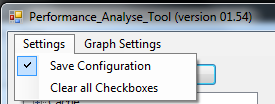

If you set the "Save Configuration" the a file will be saves in the same
folder as the Performance Analyse Tool (PAT) was executed. Be sure that
you have enough right to write into the folder otherwise disable this
option.

### Clear all Checkboxes

{width="2.0118110236220472in"
height="0.7598425196850394in"}

The "Clear all Checkboxes" is used to deselect all Checkboxes.

### No background color

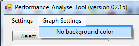

This option sets the background color of the surrounding of the graph to
white if you print or printscreen. Click on this option to switch back
to show the colors.

### Hide error numbers in graph

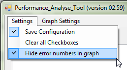

This option is used to hide the error values (minus values) in the
performance export data series name

### Top X value

This option sets globally the number of Top X elements should be set.
The default is 20. This is used in the LU and the CPU section.

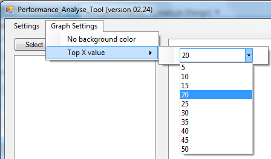

Load performance data
---------------------

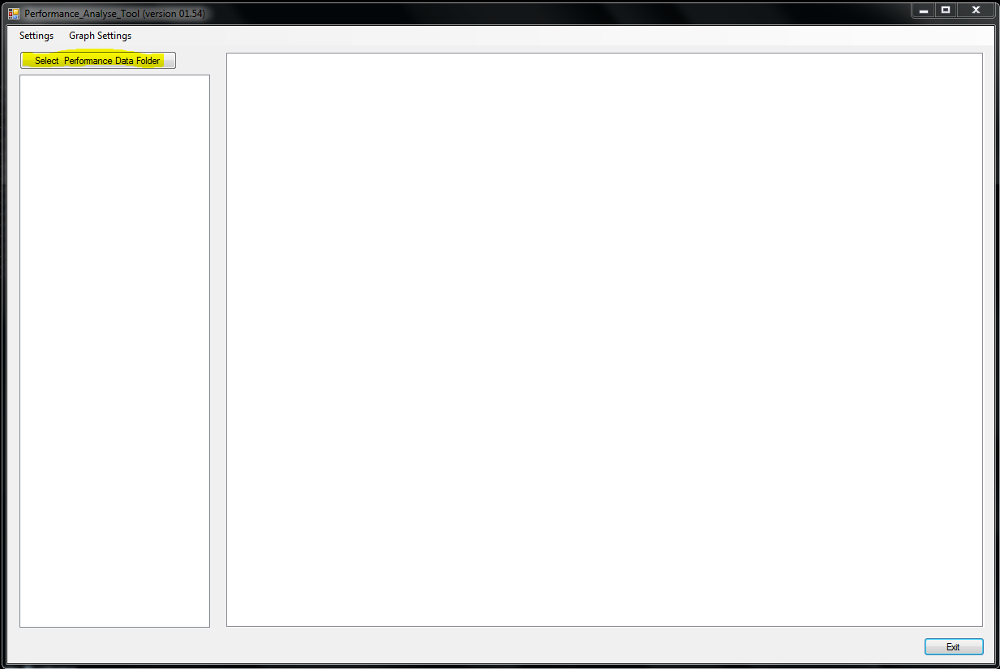

Press the „Select Performance Data Folder"

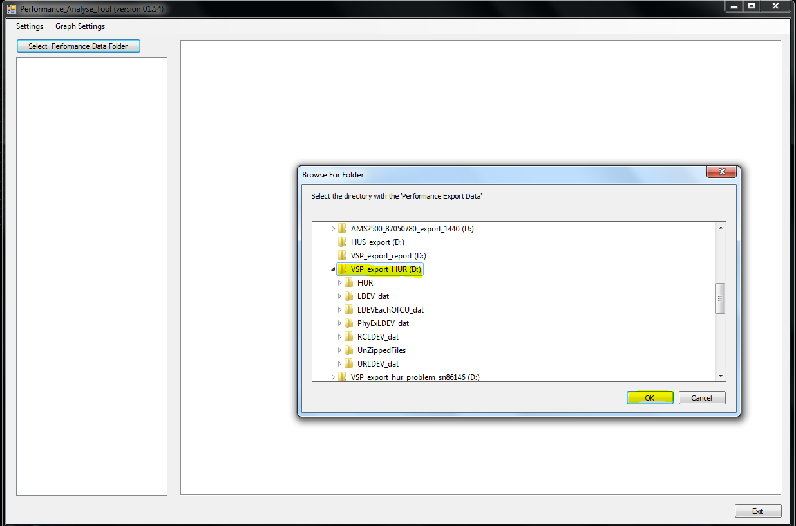

Select the folder containing the "ZIP" files.

Now the PAT starts to unzip the zip files.

Work with the GUI
-----------------

### Treeview

#### General

You have to click on the element itself to get a graph. So it depends on
the level you click on in the treeview to get different graphs. The
settings of the checkboxes only apply when you click on an element.

Some Treeview sections do not show any graphs and are just for
separating the data. These are:

-   ESW/Backend

-   HUR

-   LDEV

-   LU

-   True Copy

#### Checkboxes

For example if you click on "Cache" all Write Pending Rates of all MPs
and Cache Partitions will be shown.

If you click on "1MA" the Write Pending Rates of MP "1MA" and all its
Cache Partitions as shown.

If you select none or all checkboxes in the hierarchy below all graphs
are shown the next time you click on the element.

If you check just some checkboxes the next time you click on "1MA" it
only shows the CLPRs 00(CLPR0) and 02(CLPR2).

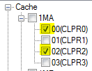

In the next example you see that this works over all hierarchies.

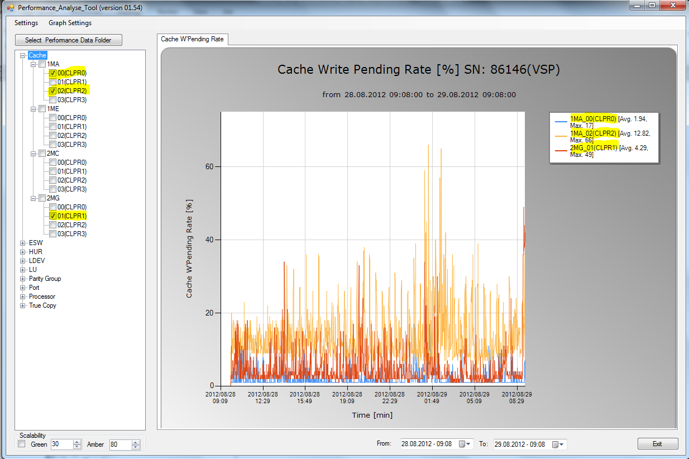

The checkbox in the higher hierarchy is to set all checkboxes in the
hierarchy below or unset all.

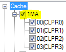

### Hide/Unhide Series

If you click on the series name in the legend you can hide or unhide a
series.

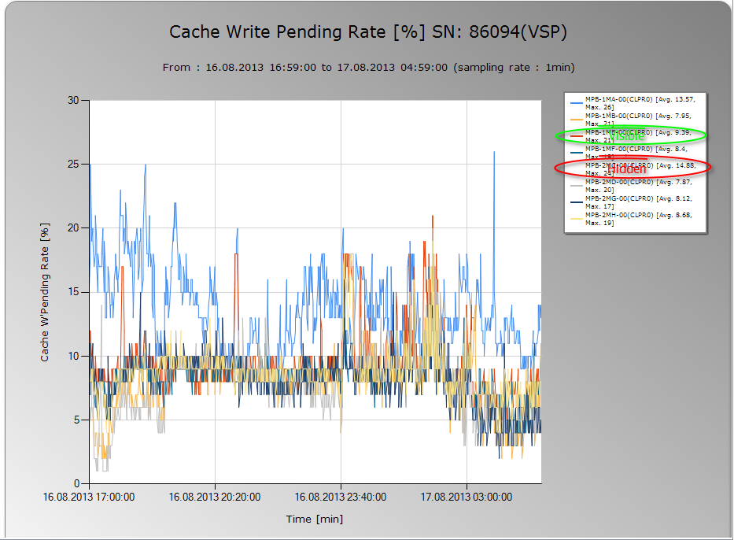

### Report Window

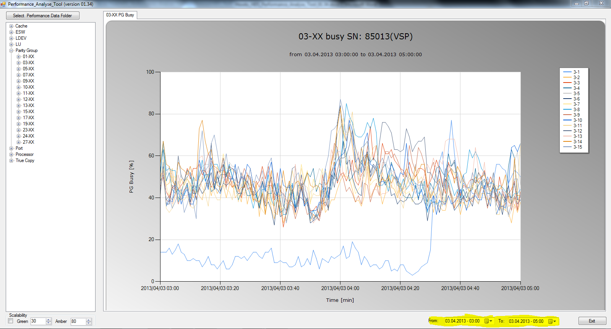

In the "Report Windows" date selector you can specify the date and time
from where you want to start showing the date and to where. With this
option you always have the same section. This setting can enormously
improve the collection time and the creation time of the graph.

### Tabs

Some selections have several charts that are created in separated tabs.

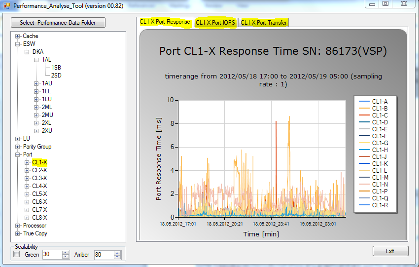

Zooming chart
-------------

#### Zooming in

In the chart you can zoom an area you like by left click the mouse and
select the area.

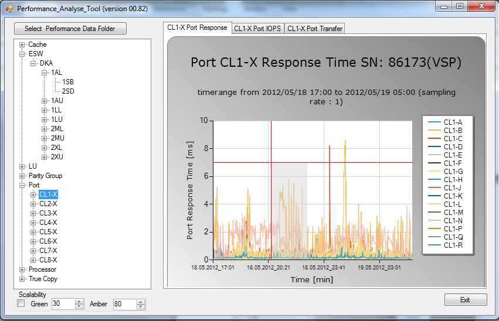

After that you get the zoom of the area selected before

### Zooming out

To zoom out you have to leftclick on the circle next to the axes.

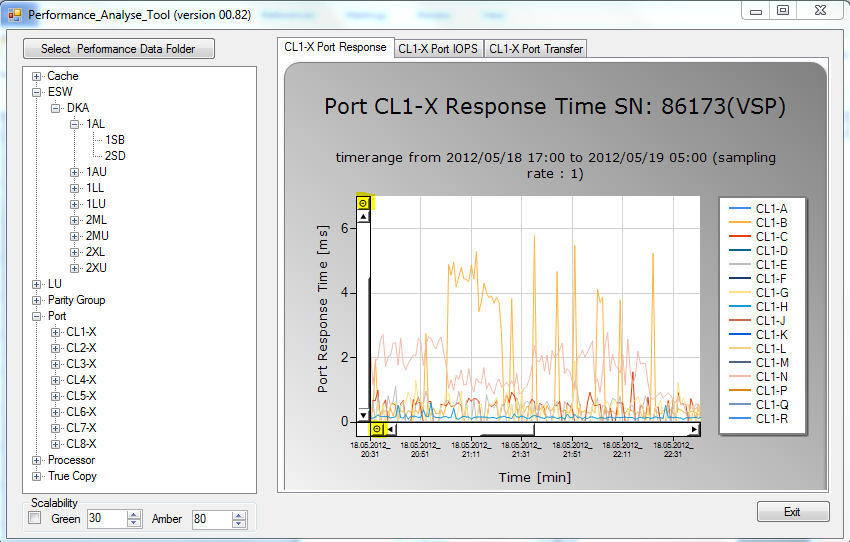

Date Time Picker
----------------

With this Date Time Picker you can select what time frame you want to
analyze. All graphs are shown in the same time frame.

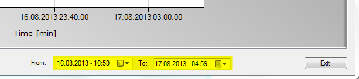

This selection does only apply for the following graphs.

Legend
------

To switch off the Legend uncheck the legend checkbox

Tooltip to show the data series name\$
--------------------------------------

If you move over a datapoint in the graph a tooltip is shown with the
name of the data series.

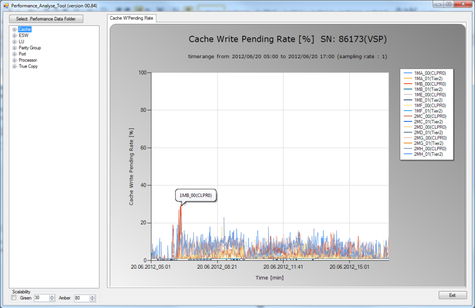

Printing a chart
----------------

Right click on the chart.

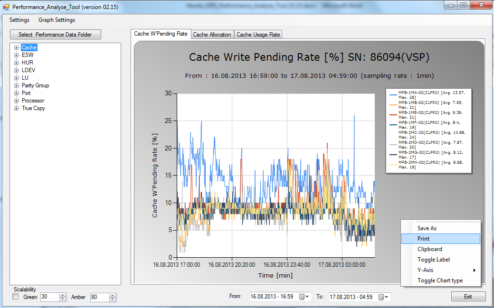

Save a chart
------------

Right click on the chart.

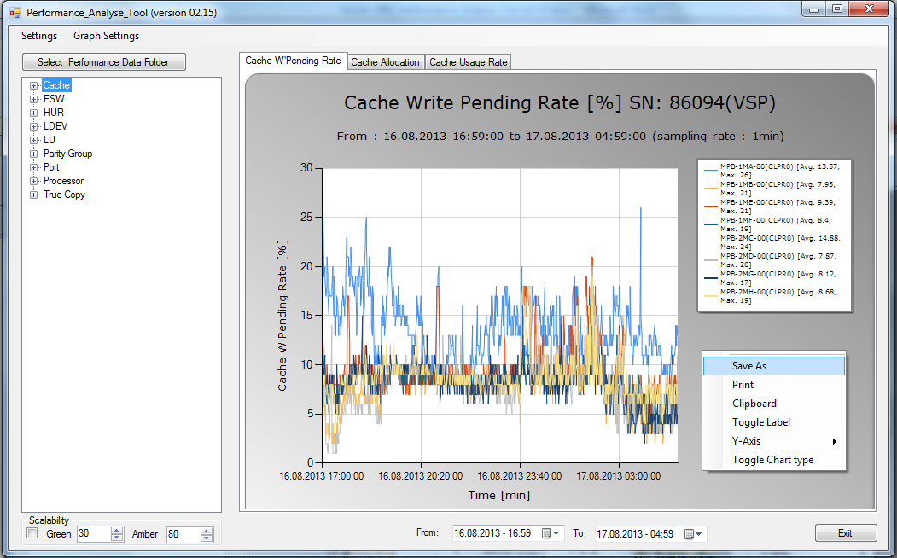

Copy to Clipboard
-----------------

Right click on the chart.

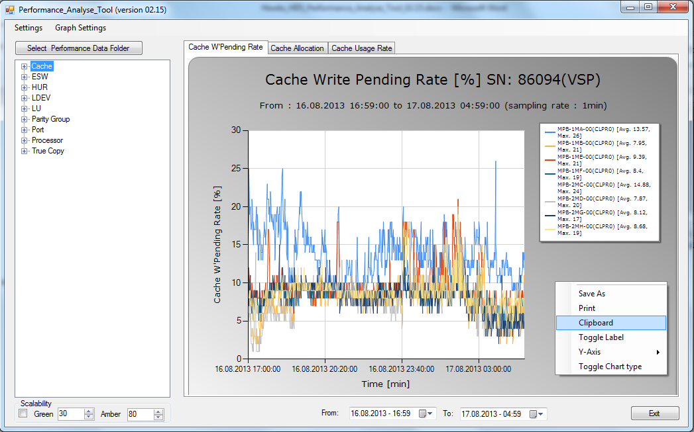

Hide/Unhide Label
-----------------

Right click on the chart.

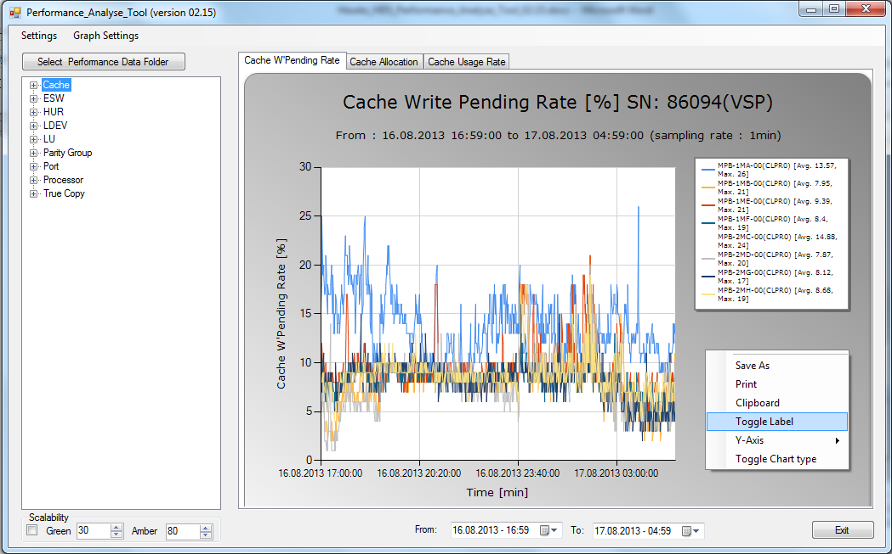

Set max value for the Y-Axis
----------------------------

Right click on the chart. Then move the mouse pointer to the Y-Axis
item. Then specify the max value for the Y-Axis and commit with the
enter key. Then the graph immediately changes the Y-Axis.

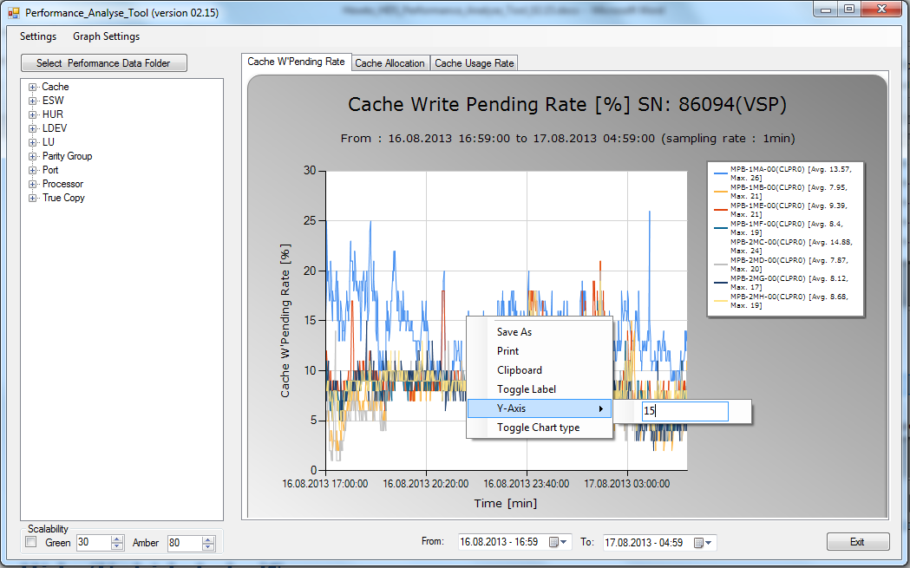

Toggle the graph type between line or stacked area
--------------------------------------------------

Right click on the chart. By clicking on the "Toggle Chart type" the
chart switches between fast line or stacked area graphs.

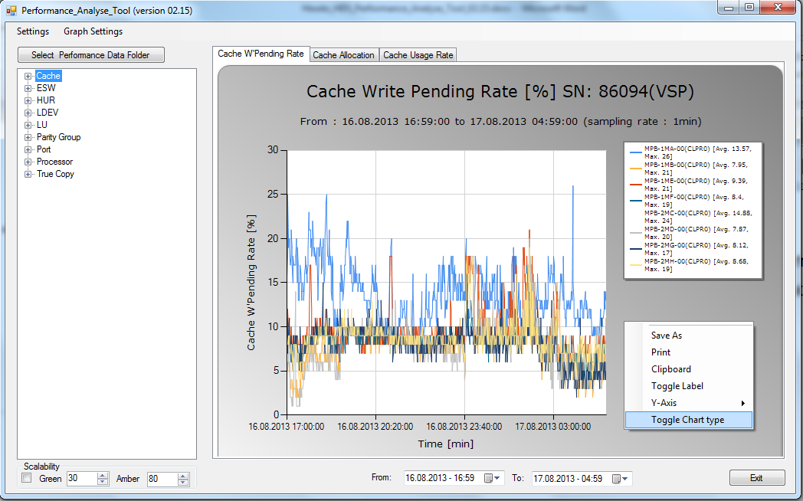
